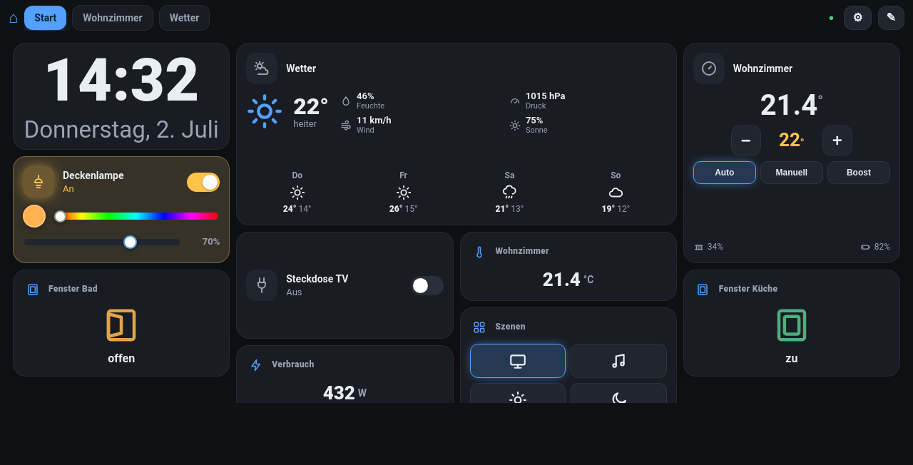

# EasyTiley

[🇩🇪 Deutsch](README.md) · **🇬🇧 English**

A web dashboard for FHEM with editable device tiles.
Add tiles, place them freely, resize, merge and save — all in the browser.



```
Browser ──HTTP/SSE──> 1 Docker container ──HTTP──> FHEMWEB
                      (nginx + php-fpm)
                           │
                           └── SQLite (data/fhem.db)  ← dashboards & tile layouts
```

> nginx **and** php-fpm run together in **one** image (via supervisord) — a single container is enough.

* **Frontend:** vanilla JS + [Gridstack](https://gridstackjs.com) (drag & drop/resize), custom tiles + themes, bilingual (DE/EN).
* **Backend:** PHP 8.3, talks to FHEMWEB via `jsonlist2` + `set` (CSRF token handled automatically).
* **Live data:** real-time FHEM push (longpoll → Server-Sent Events), 3-second polling only as fallback.
* **Storage:** SQLite, one layout per dashboard as JSON. Runs fully offline (no CDNs).

## Prerequisites

Docker + Docker Compose. If not installed yet (Ubuntu, one-time, needs sudo):

```bash
sudo apt-get update
sudo apt-get install -y docker.io docker-compose-v2
sudo usermod -aG docker "$USER"   # then log out and back in once
```

## Install & run

```bash
git clone https://github.com/Glenn-Dandy/easytiley.git && cd easytiley
mkdir -p data && chmod 777 data      # php-fpm (uid 82) must be able to write data/
docker compose up -d --build         # builds the image locally and starts the container
# -> http://localhost:8080
```

Then set the **FHEM address in the browser under ⚙ Settings** (IP:port or full
URL), **Test**, **Save** — no rebuild required. The address lives in SQLite,
so the same instance works against any FHEM without code changes.

Optionally pre-seed a default via env: `FHEM_URL=http://<ip>:8083/fhem`.
The container must be able to reach FHEM on the network (same LAN/routing).
Dashboards in `data/fhem.db` survive updates/rebuilds.

**HTTPS & password protection:** FHEMWEB with `attr WEB HTTPS 1` is supported —
just enter `https://<ip>:8083` as the address. Self-signed certificates (the
FHEM norm) are allowed by default (can be disabled in settings). If FHEMWEB is
protected with `attr WEB basicAuth …`, enter username and password in settings —
they stay server-side in SQLite and are never delivered to the browser.

**Reverse-proxy tip:** if FHEM sits behind a proxy, its buffering can delay the
real-time events (nginx: `proxy_buffering off;`) — or simply point EasyTiley
directly at FHEM's LAN address.

## Updating

Inside the cloned folder (`cd easytiley`):

```bash
git pull                      # fetch the new code
docker compose up -d --build  # rebuild the image + replace the container
```

Your dashboards in `data/fhem.db` are preserved. Clean up the old image with
`docker image prune -f`.

## Usage

1. **⚙ Settings** → enter the FHEM address, **Test**, **Save**.
   Also there: theme (dark/light), **language (Deutsch/English)**, vibration.
2. **✎ Edit** → edit mode: drag tiles freely, resize at the right/bottom edge.
3. **+ tile** → pick type + device (readings/commands are detected automatically;
   the reading dropdown shows current values).
4. **✎** on a tile → edit; **✕** → remove.
5. **🔗** → **merge** a tile with a neighbour: then tap one of the 4 docking
   edges of the target tile. Merged cards can be stacked side by side or on top
   of each other; **⧉** splits them again. Also works inside groups.
6. **Drag a tile onto a room tab** → moves it into that room.
7. **Save** → the layout is stored in SQLite. **Done** → view/control mode with live values.
8. **⛶** → fullscreen (handy for wall tablets, works over plain HTTP too).

Tile types: `value / sensor`, `switch (on/off)`, `light (on/off + RGB + CT)`,
`readingsGroup`, `button(s) / set commands`, `thermostat / heating`,
`status (window / door / contact)`, `shutter / blinds`, `chart / history
(FileLog/DbLog)`, `weather (PROPLANTA)`, `group / room box`, `clock / date`,
`note (text / checklist)`, `label / text`.

**Free grid:** tiles stay where you put them. Only empty space **above all**
tiles is removed automatically — inner gaps are kept.

**Rooms as tabs:** every tab at the top is a room/dashboard. **＋** creates one
(in edit mode); clicking the active tab renames it, **✕** deletes it, dragging
reorders the tabs.

**readingsGroup tile:** shows a FHEM `readingsGroup`. FHEM renders internally,
the backend parses values + icons and the frontend draws its **own themed
table** (refreshed every 30 s).

**Group / room box:** a nested grid in the same coordinate system as the main
grid; tiles keep their exact size when dragged in or out.

**Chart tile:** history curves straight from FileLog/DbLog — pick the log
device, choose the measurement from a readable list, time range 6 h – 7 days,
optional smoothing.

## API (PHP, under `/api/`)

| Endpoint | Method | Purpose |
|---|---|---|
| `/api/health` | GET | check FHEM connection + CSRF |
| `/api/devices?names=A,B` | GET | readings of selected devices |
| `/api/devicelist` | GET | lightweight device list for the editor |
| `/api/cmd` | POST | `{device,args}` → `set`, or raw `{cmd}` |
| `/api/stream?names=A,B` | GET | Server-Sent Events (FHEM push) |
| `/api/chart?log=L&spec=S&hours=N` | GET | history data from FileLog/DbLog |
| `/api/dashboards` | GET/POST | list / new dashboard / ordering |
| `/api/dashboard?id=N` | GET/POST/DELETE | load / save / delete a layout |

## Configuration (`.env`)

| Variable | Default |
|---|---|
| `FHEM_URL` | `http://192.168.10.2:8083/fhem` |
| `HTTP_PORT` | `8080` |
| `TZ` | `Europe/Berlin` |

## Project structure

```
docker/            Dockerfile (php-fpm) + nginx.conf
src/               Fhem.php (FHEM client), Db.php (SQLite)
public/            api.php (router) + index.html + js/ + css/ + vendor/
data/              fhem.db (SQLite, gitignored)
```

## Roadmap / possible extensions

* More tile types (camera, media).
* Stacked view for phones.
* Service worker (installable offline PWA).

## License

MIT — see [LICENSE](LICENSE).
